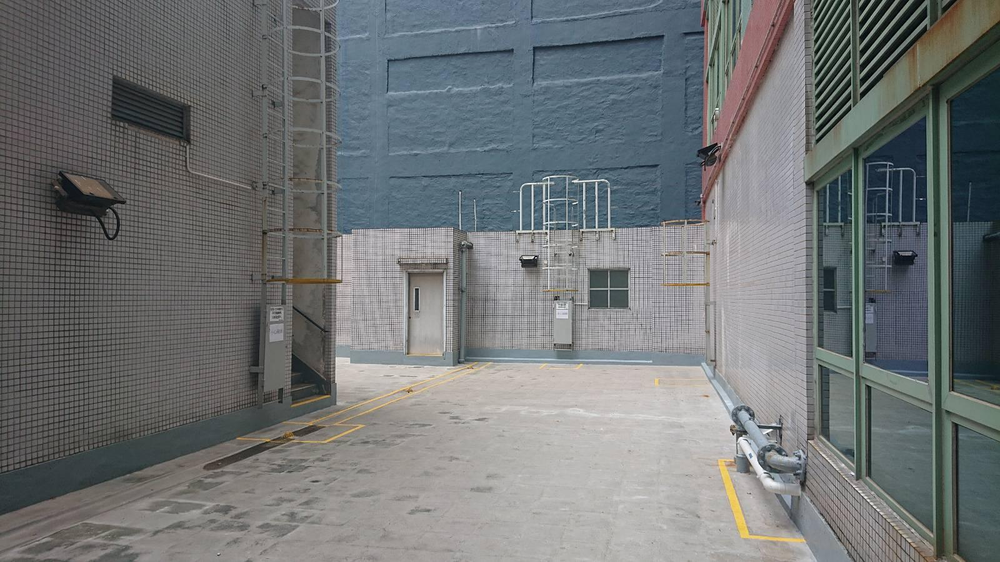
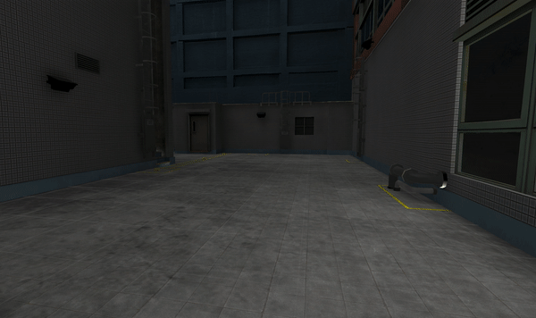
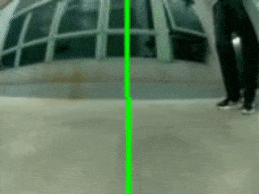
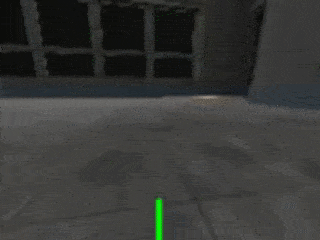
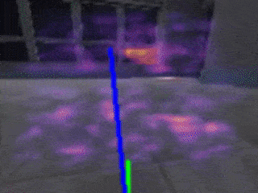
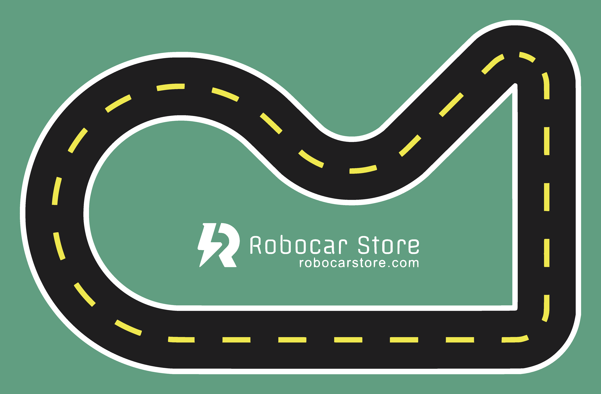
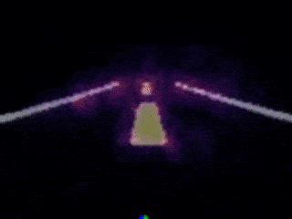
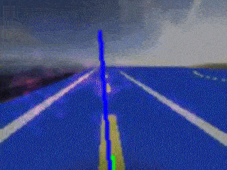
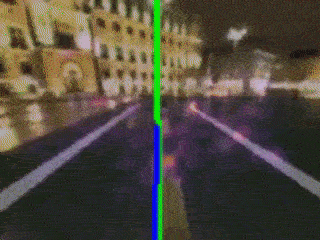

# Simulator training <!-- omit in toc -->

[view on github page](https://joesiu.github.io/sdsandbox/)

## Introduction <!-- omit in toc -->

I have been testing if it is possible to train a model inside the simulator and use that model in real life, and here are my results for different scenarios.

- [Simulator environment 1: Outdoor area](#simulator-environment-1-outdoor-area)
  - [Training method](#training-method)
  - [Version 1 (static lighting)](#version-1-static-lighting)
  - [Version 2 (dynamic lighting)](#version-2-dynamic-lighting)
  - [Conclusion](#conclusion)
- [Simulator environment 2: Robocarstore standard track](#simulator-environment-2-robocarstore-standard-track)
  - [Training method](#training-method-1)
  - [Version 1](#version-1)
  - [Version 2](#version-2)
  - [Version 3](#version-3)
  - [Conclusion](#conclusion-1)
- [Downloads](#downloads)

## Simulator environment 1: Outdoor area

The first environment is the outdoor area outside our office where I can test the donkey car. So I have recreated the environment and put it into the simulator.

**Real life location:**

**Simulator environment:**

Being a outdoor environment, the sun will be constantly moving, so in order to match the simulator lighting with real world lighting, I have make a simple day night cycle effect which allows me to adjust the sun's angle before testing.

### Training method

For this environment, I decided to create a simple model where the car would drive in a rectangle shape and turn left in each corners. I am using manual drive mode and collected ~20000 images inside the simulator, then train it in Google Colab.

Before testing out the simulator model, I trained a real life version first for reference:

|        Real life result         |            With salient map             |
| :-----------------------------: | :-------------------------------------: |
|  |  |

### Version 1 (static lighting)

In this version, I tried to match the simulator lighting to the real world lighting (cloudy)

|        Simulator result        |        With salient map        |
| :----------------------------: | :----------------------------: |
|  |  |

**Real life result:**

<iframe width="560" height="315" src="https://www.youtube.com/embed/vS7hcChmkJw" title="YouTube video player" frameborder="0" allow="accelerometer; autoplay; clipboard-write; encrypted-media; gyroscope; picture-in-picture" allowfullscreen></iframe>

The car seems to be able to detect features from the simulator in real life and is able to turn left when close to the blue wall, however, for the second corner, the result are less ideal, instead of a sharp left turn, the car performs a gentle left turn, making it go off the intended paths and crashes at the end.

### Version 2 (dynamic lighting)

Besides training using a static lighting, I also tried to test if its possible to create a more universal model where it can adopt to different lighting conditions. So I trained another model where the lighting are constantly changing at a high speed.

|        Simulator result        |        With salient map        |
| :----------------------------: | :----------------------------: |
|  |  |

**Real life result:**

<iframe width="560" height="315" src="https://www.youtube.com/embed/8JHAZ7E5iOc" title="YouTube video player" frameborder="0" allow="accelerometer; autoplay; clipboard-write; encrypted-media; gyroscope; picture-in-picture" allowfullscreen></iframe>

Unfortunately, the model seems isn't working as intended. Most of the time the car either stay still or will crash into the wall. While it is still able to detect some features like the wall or background, the result looks unstable compare to version 1.

### Conclusion

While the model isn't working as great, after comparing the real life footage to the simulator environment, I think its possible that the lighting in the simulator are too dark compare to the real life version which might affect the results.

## Simulator environment 2: Robocarstore standard track

The second environment will be the Robocarstore's standard track, I want to test if it's possible to train a universal model which allows the donkey car to drive on this track under any environment.

### Training method

For this environment, I want to train a model where it can drive around the track in either direction. I am using manual drive mode and collected ~25000 images for each direction (turn left and turn right) inside the simulator, then train it in Google Colab.

### Version 1

I think the main features of the track are the white and yellow lines, therefore I want to test if its possible to train with only the features. Here is the salient result:

Though this model doesn't work at all when put to test inside the simulator environment, the car just either stay still or drive off track.

### Version 2

The second idea is to randomize the track color as well as the background. I used around ~300 background images and randomly display it in each frame. The backgrounds are also randomly rotated each time so it won't be the same. Here is the salient result:

This model seems is able to detect the lines, and when put to test, it is able to drive mostly stable besides around corners. Here are the test results for both environment 1 and 2.

**First test result:**

<iframe width="560" height="315" src="https://www.youtube.com/embed/7-McoElVzKs" title="YouTube video player" frameborder="0" allow="accelerometer; autoplay; clipboard-write; encrypted-media; gyroscope; picture-in-picture" allowfullscreen></iframe>

**Second test result:**

<iframe width="560" height="315" src="https://www.youtube.com/embed/bwAh9c8zTmE" title="YouTube video player" frameborder="0" allow="accelerometer; autoplay; clipboard-write; encrypted-media; gyroscope; picture-in-picture" allowfullscreen></iframe>

For the second test though, the model seems is less stable, while it is able to detect some features, it often go off track.

### Version 3

Based on the test result on the previous version, I decided to randomize the brightness and saturation of the lines, and I also randomize the transparency of the ground so it won't always be a solid color and make it less perfect. Here is the salient result:

Based on the salient map, it seems the model does a better job at detecting on the lines. And when put to test, it also seems to perform better then previous models. Here are the test results for both environment 1 and 2.

**First test result:**

<iframe width="560" height="315" src="https://www.youtube.com/embed/Twb30huWV-0" title="YouTube video player" frameborder="0" allow="accelerometer; autoplay; clipboard-write; encrypted-media; gyroscope; picture-in-picture" allowfullscreen></iframe>

**Second test result:**

<iframe width="560" height="315" src="https://www.youtube.com/embed/WP1l360QW5Q" title="YouTube video player" frameborder="0" allow="accelerometer; autoplay; clipboard-write; encrypted-media; gyroscope; picture-in-picture" allowfullscreen></iframe>

For second test though, while it seems to drive better, it will still go off track depending on different lightings.

### Conclusion

It seems its possible to create a universal model with enough dataset. And I think if I can separate the ground and the main road (green and black), the result might could have been better. I would like to test the model on the real track as well.

## Downloads

You can download the models and the map here:

[https://github.com/JoeSiu/sdsandbox/tree/gh-pages/training_models](https://github.com/JoeSiu/sdsandbox/tree/gh-pages/training_models)
