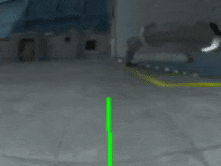

# Simulator training results

## Simulator environment

I have been trying to test if it is possible to train a model inside the simulator and use that model in real life. With that, I have created a new 3d environment for the area outside our office where I can test the donkey car.

Being a outdoor environment, the sun will be constantly moving, so in order to match the simulator lighting with real world lighting, I have make a simple day night cycle effect which allows me to adjust the sun's angle before testing.

## Training process

As the goal is to see if a model trained with the simulator can be used in real life, I decided to create a simple model where the car would drive in a rectangle shape and turn left in each corners. I am using manual drive mode and collected ~20000 images inside the simulator, then train it in Google Colab.

### Version 1 (static lighting)

In this version, I tried to match the simulator lighting to the real world lighting (cloudy)

**Simulator result:**

**Simulator result with salient map:**

**Real life result:**
<iframe width="560" height="315" src="https://www.youtube.com/embed/vS7hcChmkJw" title="YouTube video player" frameborder="0" allow="accelerometer; autoplay; clipboard-write; encrypted-media; gyroscope; picture-in-picture" allowfullscreen></iframe>

The car seems to be able to detect features from the simulator in real life and is able to turn left when close to the blue wall, however, for the second turn, the result are less ideal, instead of a sharp left turn, the car performs a gentle left turn, making it go off the intended paths and crashes at the end.
